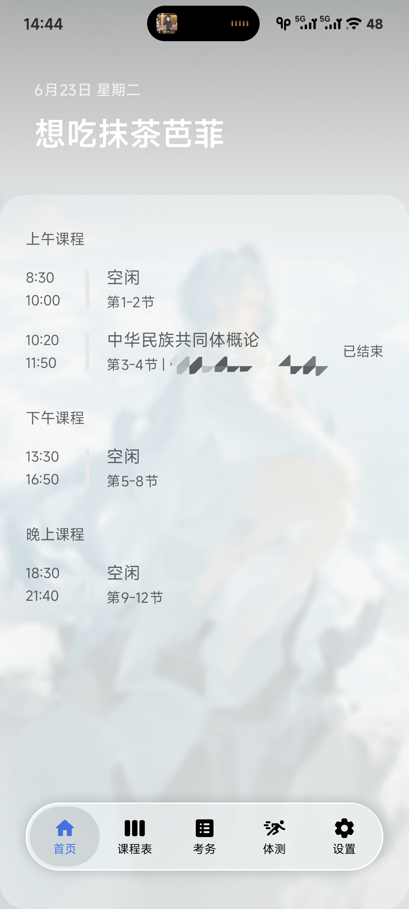
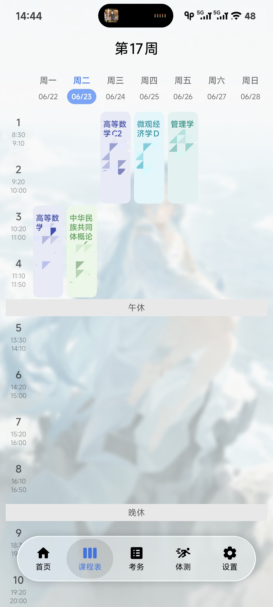
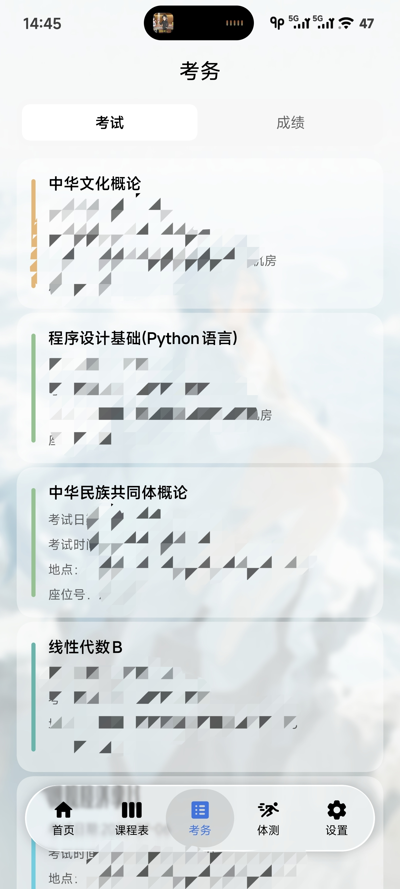
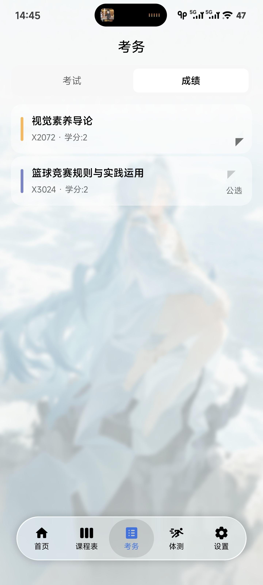
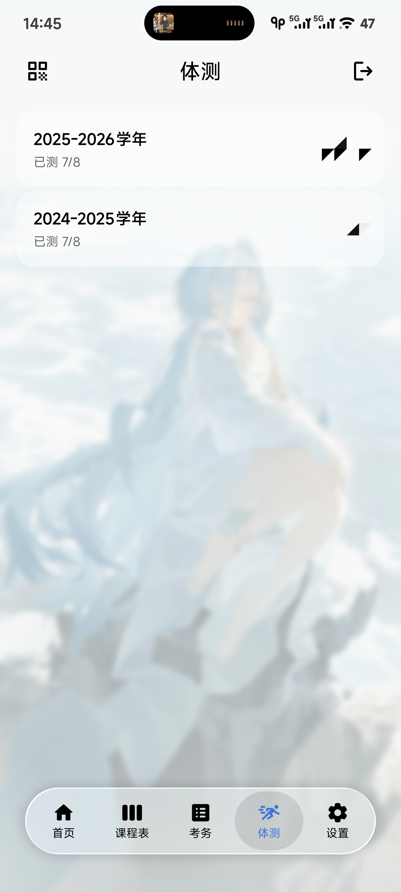
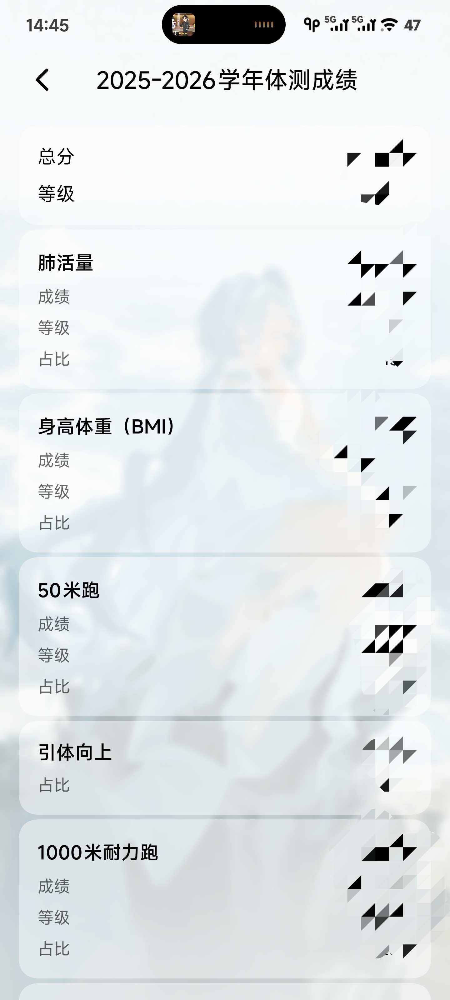
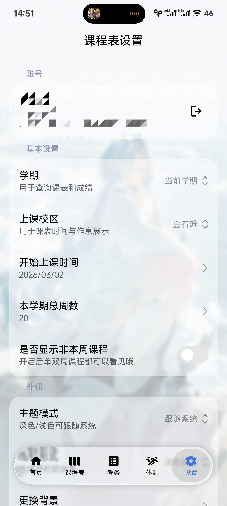

<div align="center">

# Chrnova

**一款基于 Kotlin Multiplatform 的校园课程表应用，纯本地客户端**

[](https://www.gnu.org/licenses/agpl-3.0)
[](https://kotlinlang.org)
[](https://www.jetbrains.com/lp/compose-multiplatform/)
[](https://www.android.com)
[](https://www.apple.com/ios)

[项目网站](https://github.com/restarhalf/Chrnova/blob/main/website/index.html) · [问题反馈](https://github.com/restarhalf/Chrnova/issues)

</div>

---

## 简介

Chrnova 是一款面向大学校园的课程表应用，基于 Kotlin Multiplatform 与 Compose Multiplatform 构建。课表、成绩等数据全部保存在本地，仅在需要时连接教务系统同步；应用内置公告、评教、试卷共享、抢课助手等校园服务，并配有 Android 桌面小组件。

## 应用截图

| 首页 | 课表 | 考务 | 成绩 |
|:---:|:---:|:---:|:---:|
|  |  |  |  |

| 体测 | 体测详情 | 设置 |
|:---:|:---:|:---:|
|  |  |  |

---

## 功能特性

### 课程与课表

- **智能课表** — 按周查看完整课程安排，支持单双周、调课，可调整格子高度
- **今日概览** — 首页展示当天课程与当前时段，一目了然
- **课程编辑** — 自定义添加课程，灵活调整课表
- **桌面小组件** — Android 桌面课表小组件，无需打开应用即可查看

### 考务与成绩

- **考试安排** — 查看考试时间、地点、座位号
- **成绩查询** — 学期成绩报告，绩点统计
- **体测成绩** — 体育系统体测数据同步，附详细成绩报告
- **选修学分** — 选修课程学分统计

### 校园服务

- **教务系统** — 一键登录教务系统同步课表、考试与成绩
- **体育系统** — 体测成绩查询、二维码展示
- **公告通知** — 校园公告查看，支持 Markdown 与图片渲染
- **评教** — 快速完成课程评教
- **试卷共享** — 期末试卷上传与下载

### 个性化与其他

- **自定义背景** — 上传背景图片，调整透明度
- **课程颜色** — 为不同课程设置颜色标识
- **多校区支持** — 支持金石滩校区等多校区配置
- **课表提醒** — 课程/考试提醒通知
- **日志系统** — 完整的应用日志记录
- **应用更新** — 自动检查并更新应用
- **匿名日活统计** — 每日启动上报一次本地随机设备标识（不含学号等个人信息），仅用于统计活跃设备数，详见应用内隐私政策

---

## 技术架构

```
┌─────────────────────────────────────────────────────┐
│                     UI Layer                        │
│  Compose Multiplatform + Miuix Components           │
├─────────────────────────────────────────────────────┤
│                 Navigation Layer                    │
│         Miuix Navigation + NavigationEvent          │
├─────────────────────────────────────────────────────┤
│                 ViewModel Layer                     │
│          Koin DI + Lifecycle ViewModel              │
├─────────────────────────────────────────────────────┤
│                  Domain Layer                       │
│           UseCases + Repository 接口                │
├─────────────────────────────────────────────────────┤
│                   Data Layer                        │
│   Room3 + Ktor + Multiplatform Settings             │
├─────────────────────────────────────────────────────┤
│                 Platform Layer                      │
│  Android (Widget / WorkManager) / iOS expect/actual │
└─────────────────────────────────────────────────────┘
```

---

## 技术栈

| 类别       | 技术                                     |
|----------|----------------------------------------|
| **语言**     | Kotlin 2.4.10                          |
| **UI 框架** | Compose Multiplatform 1.12.0           |
| **UI 组件** | Miuix 0.9.4-rc01                       |
| **导航**     | Miuix Navigation + NavigationEvent 1.1.2 |
| **网络**     | Ktor 3.5.2                             |
| **数据库**   | Room3 3.0.2（SQLite Bundled）            |
| **DI**     | Koin 4.2.2                             |
| **序列化**   | Kotlinx Serialization 1.11.0           |
| **异步**     | Kotlinx Coroutines 1.11.0              |
| **日期**     | Kotlinx DateTime 0.8.0                 |
| **图片**     | Coil 3.6.0                             |
| **加密**     | WhyCryptography 0.6.0                  |
| **二维码**   | QRose 1.1.2                            |
| **Markdown** | Multiplatform Markdown Renderer 0.44.0 |
| **小组件**   | Glance 1.2.0（Android）                 |
| **后台任务** | WorkManager 2.11.2（Android）           |

---

## 平台支持

| 平台          | 最低版本                 | 状态   |
|-------------|----------------------|------|
| **Android** | API 28 (Android 9.0) | 稳定  |
| **iOS**     | iOS 18.0+（Arm64 真机） | 实验性 |

---

## 项目结构

```
Chrnova/
├── composeApp/                    # 共享代码 (KMP)
│   └── src/
│       ├── commonMain/            # 公共代码
│       │   ├── kotlin/
│       │   │   └── restarhalf/stellar/schedule/
│       │   │       ├── core/      # 核心工具
│       │   │       ├── data/      # 数据层
│       │   │       ├── di/        # 依赖注入
│       │   │       ├── domain/    # 领域层
│       │   │       ├── platform/  # 平台抽象
│       │   │       └── ui/        # UI层
│       │   └── composeResources/  # 资源文件
│       ├── androidMain/           # Android平台代码（小组件等）
│       └── iosMain/               # iOS平台代码
├── androidApp/                    # Android应用壳
├── iosApp/                        # iOS应用壳（Xcode 工程）
├── workers/                       # Cloudflare Workers 后端
│   ├── announcement/              # 公告服务
│   ├── evaluate/                  # 评教服务
│   ├── paper/                     # 试卷共享服务
│   └── version/                   # 版本更新服务
└── website/                       # 项目下载页
```

---

## 快速开始

### 环境要求

- JDK 21+
- Android Studio（Android 开发）
- Xcode 16+ 与 macOS（仅 iOS 开发）
- Node.js 18+（仅 Worker 开发）

### 配置密钥

在项目根目录创建 `local.properties` 文件：

```properties
# 必填：缺少时构建会直接失败
SIGN_KEY=your_sign_key
# 必填：必须恰好 16 字节（AES-128）
AES_KEY=your_aes_key_here

# 可选：本地签名配置（不配置则使用环境变量）
KEYSTORE_PATH=/path/to/keystore.jks
KEYSTORE_PASS=your_keystore_password
KEY_ALIAS=your_key_alias
KEY_PASSWORD=your_key_password
```

对应的环境变量 `SIGN_KEY`、`AES_KEY`、`KEYSTORE_PATH`、`KEYSTORE_PASS`、`KEY_ALIAS`、`KEY_PASSWORD` 也可以替代 `local.properties` 中的配置。

### 运行应用

```bash
# Android
./gradlew :androidApp:assembleDebug        # 调试包
./gradlew :androidApp:assembleRelease      # 签名发布包
./gradlew :androidApp:assembleNonMinifiedRelease  # 不混淆的发布包，便于排查线上问题

# iOS
# 使用 Xcode 打开 iosApp/iosApp.xcodeproj
```

应用版本号统一维护在 `iosApp/Configuration/AppVersion.xcconfig` 中，Android 与 iOS 共用。

### 发布

项目通过 GitHub Actions 自动构建：推送形如 `26.08.13` 的日期格式 tag 后，CI 会构建 Android 签名 APK 并创建 GitHub Release。

---

## 后端服务

项目包含 4 个 Cloudflare Workers（TypeScript + Hono），各自独立部署：

| 服务            | 目录                | 用途     |
|---------------|-------------------|--------|
| announcement  | `workers/announcement` | 公告下发   |
| evaluate      | `workers/evaluate`     | 评教代理   |
| paper         | `workers/paper`        | 试卷共享   |
| version       | `workers/version`      | 版本更新检查 |

```bash
cd workers/paper   # 以 paper 为例，其余同理
npm install
npm run dev        # 本地开发（wrangler dev）
npm run deploy     # 部署到 Cloudflare（wrangler deploy）
```

---

## 开源协议

本项目采用 [GNU Affero General Public License v3.0](LICENSE) 开源协议。

```
Copyright (C) 2024 restarhalf

This program is free software: you can redistribute it and/or modify
it under the terms of the GNU Affero General Public License as published
by the Free Software Foundation, either version 3 of the License, or
(at your option) any later version.
```

---

## 致谢

- [Compose Multiplatform](https://www.jetbrains.com/lp/compose-multiplatform/) — 跨平台UI框架
- [miuix](https://github.com/yukonga/miuix) — 小米风格UI组件库
- [Room3](https://developer.android.com/jetpack/androidx/releases/room3) — 本地数据库
- [Ktor](https://ktor.io/) — 跨平台HTTP客户端

---

<div align="center">

**[回到顶部](#chrnova)**

</div>
